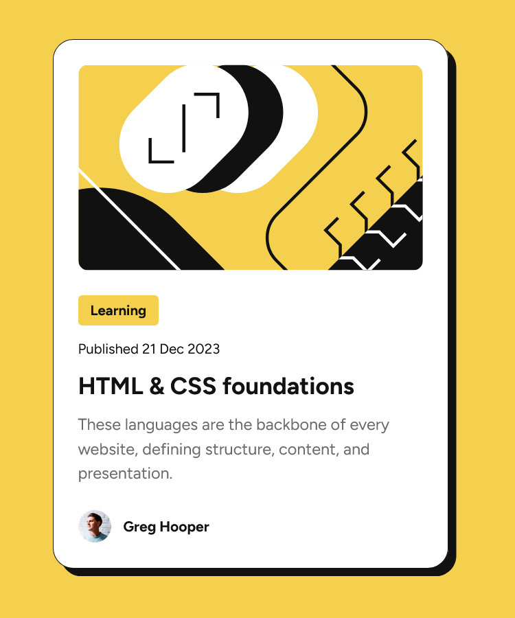

# Frontend Mentor - Blog preview card solution

This is a solution to the [Blog preview card challenge on Frontend Mentor](https://www.frontendmentor.io/challenges/blog-preview-card-ckPaj01IcS). Frontend Mentor challenges help you improve your coding skills by building realistic projects. 

## Table of contents

- [Overview](#overview)
  - [The challenge](#the-challenge)
  - [Screenshot](#screenshot)
  - [Links](#links)
- [My process](#my-process)
  - [Built with](#built-with)
  - [What I learned](#what-i-learned)
  - [Continued development](#continued-development)
  - [Useful resources](#useful-resources)
- [Author](#author)


## Overview

### The challenge

Users should be able to:

- View the optimal layout for the interface depending on their device's screen size
- See hover and focus states for all interactive elements on the page

### Screenshot



### Links

- Solution URL: [FEM solution URL](https://www.frontendmentor.io/challenges/blog-preview-card-ckPaj01IcS/hub)
- Live Site URL: [live URL](https://blog-preview-card-blush-eight.vercel.app/)

## My process

### Built with

- Semantic HTML5 markup
- CSS custom properties
- Flexbox
- Mobile-first workflow


### What I learned

I used some of the principles of Heydon Pickering's [Inclusive Components blog](https://inclusive-components.design/cards/), specifically the card section. Making the entire card clickable seemed appropriate so I followed his pseudo-content approach. 

Additionally, I'm late addopting the `:is()` pesudo-class in many of my projects, but was happy to find it a simple and useful method here.

```css
.card a::after {
  content: '';
  position: absolute;
  top: 0;
  right: 0;
  bottom: 0;
  left: 0;
}

.card a:is(:hover, :focus-visible) {
  color: var(--clr-primary);
}
```

### Continued development

I've seen some other FEM users scope many of the custom variables locally within the their card elements. This seems like a great approach and something I'll look to do in the future with similar components.

### Useful resources

- [Inclusive Components](https://inclusive-components.design) - Noted above, but here it is again. This content may be several years old, but the design patterns Heydon Pickering walks you through are excellent.

## Author

- Website - [Matt Pahuta](https://www.mattpahuta.com)
- Frontend Mentor - [@mattpahuta](https://www.frontendmentor.io/profile/MattPahuta)
- Twitter - [@mattpahuta](https://www.twitter.com/MattPahuta)
- LinkedIn - [Matt Pahuta](www.linkedin.com/in/mattpahuta)
